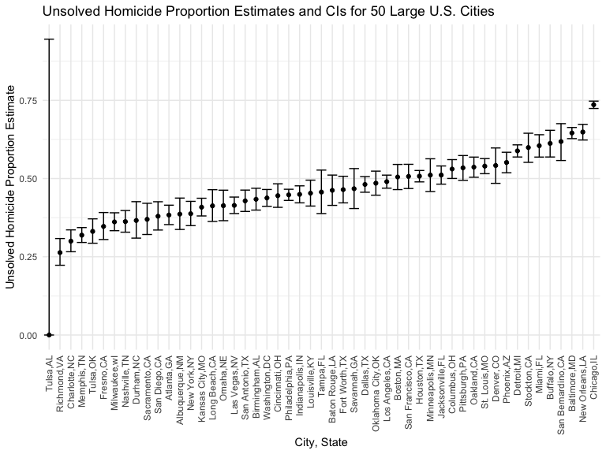

Homework 5
================
Elaine Yanxi Chen
2022-11-15

## Packages and settings

First we load the packages necessary to knit this document.

``` r
library(tidyverse)
library(p8105.datasets)
library(viridis)

knitr::opts_chunk$set(
    echo = TRUE,
    warning = FALSE,
    fig.width = 8, 
  fig.height = 6,
  out.width = "90%"
)

theme_set(theme_minimal() + theme(legend.position = "bottom"))

options(
  ggplot2.continuous.colour = "viridis",
  ggplot2.continuous.fill = "viridis"
)

scale_colour_discrete = scale_colour_viridis_d
scale_fill_discrete = scale_fill_viridis_d
```

## Problem 1

The study data for each participant is included in a separate file which
include the subject ID and arm. We want to create a tidy dataframe with
data from all participants, including the subject ID, arm, and
observations over time.

First, we want a dataframe with all file names. After, we map the
`read_csv` function over each path name, which creates a list column.
Lastly, we use `unnest` to expand the list column.

``` r
full_df = 
  tibble(
    files = list.files("data/data/"),
    path = str_c("data/data/", files)
  ) %>% 
  mutate(data = map(path, read_csv)) %>% 
  unnest()
```

Now we need to tidy the result. And file names to include control arm
and subject ID. Tidy weekly observations and perform other tidying as
needed.

``` r
tidy_df = 
  full_df %>% 
  mutate(
    files = str_replace(files, ".csv", ""),
    group = str_sub(files, 1, 3)
  ) %>% 
  pivot_longer(
    week_1:week_8,
    names_to = "week",
    values_to = "outcome",
    names_prefix = "week_"
  ) %>% 
  select(group, subj = files, week, outcome)
```

Lastly, we will make a spaghetti plot for observations on each subject
over time.

``` r
tidy_df %>% 
  ggplot(aes(x = week, y = outcome, group = subj, colour = group)) +
  geom_point() +
  geom_path() +
  facet_grid(~group)
```


Comparing the two groups, we see that the average outcome is much lower
in the control group than the experimental group. In addition, while
outcome for the control group remained fairly constant, the outcome for
the experimental group increased steadily from week 1 to week 8.

## Problem 2

This dataset contains information on more than 52,000 criminal homicides
over the past decade in 50 of the largest American cities. The
information include the location and arrest information on each killing,
along with basic demogrpahic information about each victim. We first
download the data from the github repo and import it.

``` r
homicide_raw = read_csv(file = "data/homicide-data.csv")
```

    ## Rows: 52179 Columns: 12
    ## ── Column specification ────────────────────────────────────────────────────────
    ## Delimiter: ","
    ## chr (9): uid, victim_last, victim_first, victim_race, victim_age, victim_sex...
    ## dbl (3): reported_date, lat, lon
    ## 
    ## ℹ Use `spec()` to retrieve the full column specification for this data.
    ## ℹ Specify the column types or set `show_col_types = FALSE` to quiet this message.

The raw data contains 52179 rows and 12 columns. It has variables on the
case ID, date, location including city, state, latitude, and longtitude,
victim information including race, age, sex, and disposition.

Next, we want to create a `city_state` variable to summarize within
cities the total number of homicides and the number of unsolved
homicides.

``` r
homicide_raw = homicide_raw %>% 
  janitor::clean_names() %>% 
  mutate(
    city_state = str_c(city, state, sep = ","),
    status = 
      case_when(
      disposition == "Closed without arrest" ~ "unsolved",
      disposition == "Open/No arrest" ~ "unsolved",
      disposition == "Closed by arrest" ~ "solved"
    )) 

homicide_city = homicide_raw %>% 
  group_by(city_state) %>% 
  summarize(
    total = n(),
    unsolved = sum(status == "unsolved")
  )
```

Now we want to use the `prop.test` function to estimate the proportion
of homicides unsolved in Baltimore, MD.

Need to pull the estimated proportion and confidence intervals from the
resulting tidy dataframe.

``` r
prop.test(
  x = homicide_city %>% filter(city_state == "Baltimore,MD") %>% pull(unsolved),
  n = homicide_city %>% filter(city_state == "Baltimore,MD") %>% pull(total)) %>% 
  saveRDS(., file = "data/prop_test_balt.rds")

readRDS(file = "data/prop_test_balt.rds") %>% broom::tidy() %>% pull(estimate)
```

    ##         p 
    ## 0.6455607

Now we need to run the same test for each of the cities in the dataset
and extract the porportion of unsolved homicides and the confidence
interval for each.

``` r
homicide_prop = 
  homicide_city %>% 
  mutate(
    proportions = map2(.x = unsolved, .y = total, ~prop.test(x = .x, n = .y)),
    tidied = map(.x = proportions, ~broom::tidy(.x))
  ) %>% 
  select(-proportions) %>% 
  unnest(tidied) %>% 
  select(city_state, estimate, conf.low,conf.high)
```

Now we need to create a plot that shows the estimates and CIs for each
city. We can use `geom_errorbar` to add error bars based on the upper
and lower limits. Lastly, we organize the cities according to the
porpotion of unsolved homicides.

``` r
homicide_plot = homicide_prop %>% 
  ggplot(aes(x = fct_reorder(city_state, estimate), y = estimate)) + 
  geom_point() +  
  geom_errorbar(aes(ymin = conf.low, ymax = conf.high)) +
  theme(axis.text.x = element_text(angle = 90, vjust = 0.5, hjust = 1))

homicide_plot
```



## Problem 3
