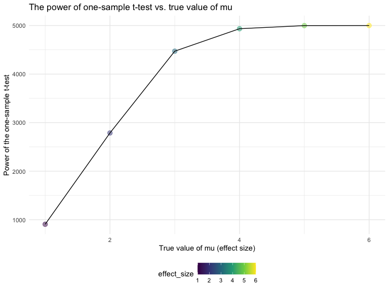
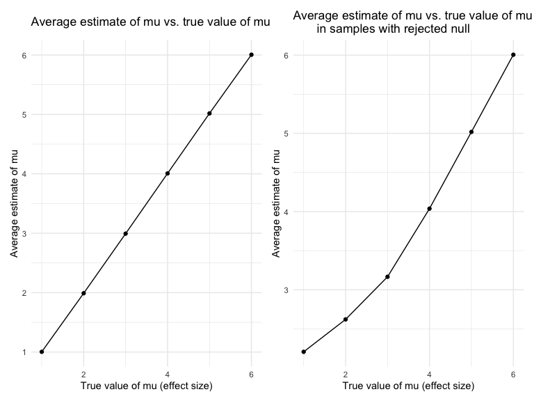

Homework 5
================
Elaine Yanxi Chen
2022-11-16

## Packages and settings

First we load the packages necessary to knit this document.

``` r
library(tidyverse)
library(p8105.datasets)
library(viridis)
library(patchwork)

set.seed(1)

knitr::opts_chunk$set(
    echo = TRUE,
    warning = FALSE,
    fig.width = 8, 
  fig.height = 6,
  out.width = "90%"
)

theme_set(theme_minimal() + theme(legend.position = "bottom"))

options(
  ggplot2.continuous.colour = "viridis",
  ggplot2.continuous.fill = "viridis"
)

scale_colour_discrete = scale_colour_viridis_d
scale_fill_discrete = scale_fill_viridis_d
```

## Problem 1

The study data for each participant is included in a separate file which
include the subject ID and arm. We want to create a tidy dataframe with
data from all participants, including the subject ID, arm, and
observations over time.

First, we want a dataframe with all file names. After, we map the
`read_csv` function over each path name, which creates a list column.
Lastly, we use `unnest` to expand the list column.

``` r
full_df = 
  tibble(
    files = list.files("data/data/"),
    path = str_c("data/data/", files)
  ) %>% 
  mutate(data = map(path, read_csv)) %>% 
  unnest()
```

Now we need to tidy the result. And file names to include control arm
and subject ID. Tidy weekly observations and perform other tidying as
needed.

``` r
tidy_df = 
  full_df %>% 
  mutate(
    files = str_replace(files, ".csv", ""),
    group = str_sub(files, 1, 3)
  ) %>% 
  pivot_longer(
    week_1:week_8,
    names_to = "week",
    values_to = "outcome",
    names_prefix = "week_"
  ) %>% 
  select(group, subj = files, week, outcome)
```

Lastly, we will make a spaghetti plot for observations on each subject
over time.

``` r
tidy_df %>% 
  ggplot(aes(x = week, y = outcome, group = subj, colour = group)) +
  geom_point() +
  geom_path() +
  facet_grid(~group)
```


Comparing the two groups, we see that the average outcome is much lower
in the control group than the experimental group. In addition, while
outcome for the control group remained fairly constant, the outcome for
the experimental group increased steadily from week 1 to week 8.

## Problem 2: Homicide rates

This dataset contains information on more than 52,000 criminal homicides
over the past decade in 50 of the largest American cities. The
information include the location and arrest information on each killing,
along with basic demogrpahic information about each victim. We first
download the data from the github repo and import it.

``` r
homicide_raw = read_csv(file = "data/homicide-data.csv")
```

    ## Rows: 52179 Columns: 12
    ## ── Column specification ────────────────────────────────────────────────────────
    ## Delimiter: ","
    ## chr (9): uid, victim_last, victim_first, victim_race, victim_age, victim_sex...
    ## dbl (3): reported_date, lat, lon
    ## 
    ## ℹ Use `spec()` to retrieve the full column specification for this data.
    ## ℹ Specify the column types or set `show_col_types = FALSE` to quiet this message.

The raw data contains 52179 rows and 12 columns. It has variables on the
case ID, date, location including city, state, latitude, and longtitude,
victim information including race, age, sex, and disposition.

Next, we want to create a `city_state` variable to summarize within
cities the total number of homicides and the number of unsolved
homicides.

``` r
homicide_raw = homicide_raw %>% 
  janitor::clean_names() %>% 
  mutate(
    city_state = str_c(city, state, sep = ","),
    status = 
      case_when(
      disposition == "Closed without arrest" ~ "unsolved",
      disposition == "Open/No arrest" ~ "unsolved",
      disposition == "Closed by arrest" ~ "solved"
    )) 

homicide_city = homicide_raw %>% 
  group_by(city_state) %>% 
  summarize(
    total = n(),
    unsolved = sum(status == "unsolved")
  )
```

Now we want to use the `prop.test` function to estimate the proportion
of homicides unsolved in Baltimore, MD. We will also pull the estimate
and the 95% confidence interval of the proportion of unresolved
homicides in Baltimore, MD, from the proportion test results.

``` r
prop_balt = prop.test(
  x = homicide_city %>% filter(city_state == "Baltimore,MD") %>% pull(unsolved),
  n = homicide_city %>% filter(city_state == "Baltimore,MD") %>% pull(total), 
  alternative = c("two.sided"),
  conf.level = 0.95,
  correct = TRUE) 

prop_balt %>% 
  saveRDS(., file = "data/prop_test_balt.rds")

prop_balt %>% broom::tidy() %>% select(c(estimate, conf.low, conf.high))
```

    ## # A tibble: 1 × 3
    ##   estimate conf.low conf.high
    ##      <dbl>    <dbl>     <dbl>
    ## 1    0.646    0.628     0.663

Now we need to run the same test for each of the cities in the dataset
and extract the proportion of unsolved homicides and the confidence
interval for each. To do so, we could `map` the `prop.test` function
over the unsolved and total number of homicides of each city. After, we
pipe the result into a clean dataset by using the `broom::tidy()`
function. We then `unnest` the list column from the tidied dataset and
select only the esetimate and confidence intervals that we are
interested in for each `city_state`.

``` r
homicide_prop = 
  homicide_city %>% 
  mutate(
    proportions = map2(.x = unsolved, .y = total, ~prop.test(x = .x, n = .y)),
    tidied = map(.x = proportions, ~broom::tidy(.x))
  ) %>% 
  unnest(tidied) %>% 
  select(city_state, estimate, conf.low, conf.high)
```

Now we need to create a plot that shows the estimates and CIs for each
city. We can use `geom_errorbar` to add error bars based on the upper
and lower limits. Lastly, we organize the cities according to the
porpotion of unsolved homicides.

``` r
homicide_plot = homicide_prop %>% 
  ggplot(aes(x = fct_reorder(city_state, estimate), y = estimate)) + 
  geom_point() +  
  geom_errorbar(aes(ymin = conf.low, ymax = conf.high)) +
  theme(axis.text.x = element_text(angle = 90, vjust = 0.5, hjust = 1)) +
  labs(title = "Unsolved Homicide Proportion Estimates and CIs for 50 Large U.S. Cities",
       x = "City, State",
       y = "Unsolved Homicide Proportion Estimate")

homicide_plot
```


## Problem 3: Simulation

In this problem, we run a simulation to explore the power in a
one-sample t-test. We fix the sample size n = 30 and the error variance
sigma = 5, and explore how changes in the effect size mu would affect
the power of the t-test.

First, we will generate 5000 datasets from the normal distribution
model. We will then use one-sample t-test and calculate a p-value by
using `broom::tidy` to clean the output of the `t.test`. We combine
output from each test using `bind_rows` to generate a tibble with the
estimate and the p-value of each test.

``` r
sim_power = function(mu = 0, n = 30, sigma = 5) {
  
  sim_data = tibble(
    x = rnorm(n, mean = mu, sd = sigma),
  )
  
  t.test(sim_data) %>% 
    broom::tidy() %>% 
    select(estimate, p.value)
  
}

output = vector("list", 5000)

for (i in 1:5000) {
  
  output[[i]] = sim_power()
}

sim_results = bind_rows(output)
```

Alternatively, we could have used:

``` r
expand_grid(
    means = 0,
    iter = 1:5000
  ) %>% 
  mutate(
    estimate_df = map(means, sim_power)
  ) %>% 
  unnest(estimate_df)
```

    ## # A tibble: 5,000 × 4
    ##    means  iter estimate p.value
    ##    <dbl> <int>    <dbl>   <dbl>
    ##  1     0     1    0.520   0.549
    ##  2     0     2    1.11    0.188
    ##  3     0     3    1.01    0.220
    ##  4     0     4   -0.835   0.309
    ##  5     0     5   -0.892   0.365
    ##  6     0     6    0.557   0.503
    ##  7     0     7    1.04    0.238
    ##  8     0     8    1.40    0.144
    ##  9     0     9    1.15    0.180
    ## 10     0    10   -0.500   0.634
    ## # … with 4,990 more rows

Next, we want to repeat the same process but for different effect size
of mu = {1, 2, 3, 4, 5, 6}.

``` r
sim_results_df = 
  expand_grid(
    effect_size = c(1:6),
    iter = 1:5000
  ) %>% 
  mutate(
    estimate_df = map(effect_size, sim_power)
  ) %>% 
  unnest(estimate_df)
```

Next we want to make a plot showing the proportion of times the null was
rejected, the power of the test, on the y-axis and the true value of mu
on the x axis.

``` r
power_plot = sim_results_df %>% 
  group_by(effect_size) %>% 
  summarize(
    reject = sum(p.value < 0.05, na.rm = TRUE)
  ) %>% 
  ggplot(aes(x = effect_size, y = reject)) +
  geom_point(aes(colour = effect_size), size = 3, alpha = 0.5) +
  geom_line() +
   labs(title = "The power of one-sample t-test vs. true value of mu",
       x = "True value of mu (effect size)", 
       y = "Power of the one-sample t-test")

power_plot
```



Based on the plot we can see that the power increases as the effect size
increases.

Now we want to make a plot showing the average estimate of mu on the y
axis and the true value of mu on the x axis.

``` r
avg_est_plot = sim_results_df %>% 
  group_by(effect_size) %>% 
  summarize(avg_est_mu = mean(estimate)) %>% 
  ggplot(aes(x = effect_size, y = avg_est_mu)) +
  geom_point() + 
  geom_line() +
  labs(title = "Average estimate of mu vs. true value of mu",
       x = "True value of mu (effect size)", 
       y = "Average estimate of mu") +
  scale_y_continuous(
    breaks = c(0, 1, 2, 3, 4, 5, 6)
  )

avg_est_plot
```


And finally we want another plot showing the average estimate of mu only
in samples for which null was rejected on the y axis.

``` r
reject_plot = sim_results_df %>% 
  filter(p.value < 0.05) %>% 
  group_by(effect_size) %>% 
  summarize(avg_est_mu = mean(estimate)) %>% 
  ggplot(aes(x = effect_size, y = avg_est_mu)) +
  geom_point() + 
  geom_line() +
  labs(title = "Average estimate of mu vs. true value of mu
       in samples with rejected null",
       x = "True value of mu (effect size)", 
       y = "Average estimate of mu") +
  scale_y_continuous(
    breaks = c(0, 1, 2, 3, 4, 5, 6)
  )

reject_plot
```


``` r
avg_est_plot + reject_plot
```



Based on the plots, we can see that the sample average of mu across
tests for which the null is rejected is not always approximately equal
to the true value of mu. We see that when mu is less than 4, the
approximation is very poor. This is because of the low power to reject
the null when the effect size is small. As the effect size increases,
the power increases, and hence the the average mu for which the null is
rejected gets closer and closer to the true value of mu. When the effect
size is greater or equal to 4, the two values approximate each other
well.
